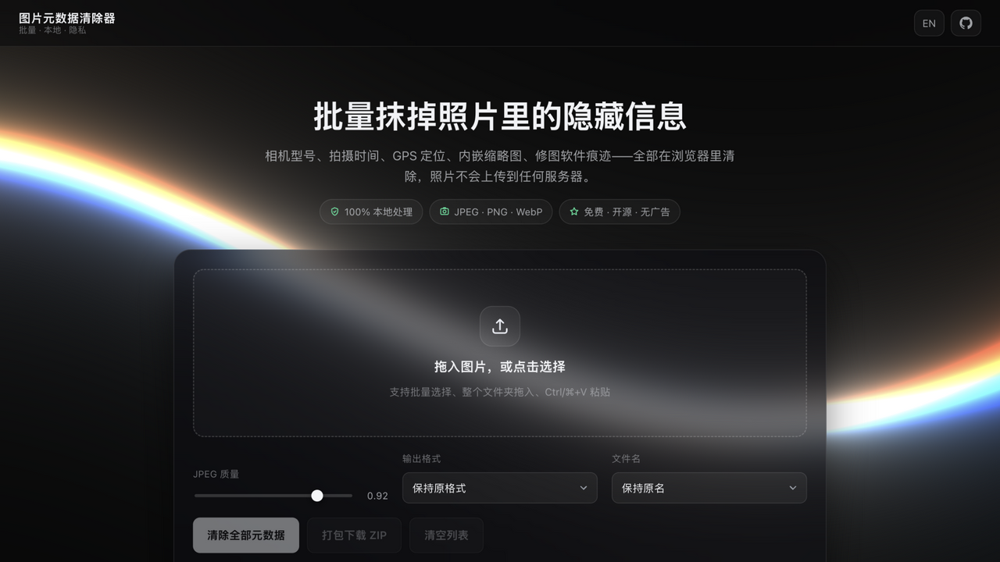

# Image Meta Cleaner · 图片元数据清除器

> 批量抹掉照片里的隐藏信息——EXIF 相机型号、拍摄时间、GPS 定位、内嵌缩略图、修图软件痕迹、文件尾部隐藏数据。**纯静态部署，全部处理在浏览器里完成，照片不上传任何服务器。**

[](https://forjiang.github.io/image-metadata-cleaner/)
[](LICENSE)
[](index.html)
[](tests/test-all.mjs)

English intro at the bottom → [English](#-english)

---

## ✨ 功能特性

| | |
| --- | --- |
| 🧹 **真正的物理清除** | Canvas 重编码 + 编码后强制拆段，连 Safari 编码器自行写回的 ICC 色彩配置也一并移除，输出零元数据 |
| 🖥️ **处理日志窗口** | 终端风格实时显示执行过程：`$ open` → 扫描发现的每个元数据段 → `decode` → `encode` → `strip` → `verify` → `done`，毫秒级时间戳，✓/✗ 分级配色 |
| 🔍 **先扫描后清除** | 入队即扫描，逐项列出将移除的内容：EXIF（相机/时间/软件）、**GPS 坐标（精确到小数点后 5 位）**、内嵌缩略图、XMP、IPTC/Photoshop、ICC、注释段、PNG 文本块、EOI 后尾部隐藏数据 |
| 📦 **批量与打包** | 拖入任意多张图片（支持整个文件夹拖入、Ctrl/⌘+V 粘贴），单文件下载或打包 ZIP 一次带走 |
| 🎚️ **输出可控** | JPEG 质量滑块（0.6–1.0）、保持原格式 / 全部转 JPEG / 全部转 PNG、文件名可加 `_clean` 后缀；改了选项自动重新入队 |
| ✅ **自检闭环** | 清除后对输出再次扫描，理论上残留为 0；UI 展示每项元数据的移除清单与体积变化 |
| 🌐 **中英双语** | 跟随系统语言，可手动切换，移动端自适应 |
| 🎬 **卡片入场动画** | 主面板、日志面板、FAQ、汇总统计随滚动淡入上移，滚动 / 缩放 / 横竖屏切换均触发；新入队的文件卡片按 45ms 错峰入场（上限 270ms），清除列表后重新入队会再次播放；全程只动 opacity/transform 并提升独立合成层，文字锐利不掉帧；`prefers-reduced-motion` 下自动静止，无 JS 时内容直接可见 |
| 📱 **移动端稳定** | 背景画布尺寸稳定捕获（忽略地址栏收放带来的微小高度变化、resize 防抖）+ 独立合成层，滚动时背景钉住不滑不抖；毛玻璃效果按屏幕宽度降级，保证滚动流畅 |
| 🔒 **隐私优先** | 无任何上传代码，断网也能用；无日志、无追踪 |
| 🚀 **真正静态** | 无构建、无依赖安装，GitHub Pages 直接发布；自带 69 项单元测试 |

## 🖼️ 界面预览



深色玻璃面板 + WebGL 正弦波线条背景（原生 WebGL1 复刻 three.js `RawShaderMaterial` 效果，零第三方依赖，绘制缓冲按设备像素比渲染——retina 屏上亮线原生逐像素、边缘锐利，实测帧时间不达标时自动降到 1.5 档但绝不变糊；`prefers-reduced-motion` 下自动静止、页面隐藏时暂停渲染；移动端滚动时背景稳定，不随地址栏收放重排）。顶栏固定 60px 高，与 [rvc-sound-clone](https://forjiang.github.io/rvc-sound-clone/) 的排版规格一致。

## 🧩 它是怎么工作的

```
浏览器（纯静态站点）
 ├─ 拖入 / 选择 / 粘贴 ──► scanMetadata 扫描（只读，列出将移除什么）
 ├─ createImageBitmap（imageOrientation: from-image，烘焙 EXIF 方向）
 ├─ Canvas 重编码 ──► toBlob（新文件只含像素，元数据天然不带入）
 ├─ stripFileMeta 二次拆除（兜底：编码器写回的 ICC 等照样拆掉）
 ├─ 再次 scanMetadata 自检 ──► 应为 0
 └─ 单文件下载 / 自绘 ZIP（store 模式，CRC32 自己算）
```

| 模块 | 职责 |
| --- | --- |
| `assets/js/metadata-scan.js` | JPEG 段遍历 + TIFF/EXIF 解析（含 GPS DMS→十进制换算）、PNG 块解析、WebP chunk 解析 |
| `assets/js/strip.js` | 编码后强制拆段：JPEG 去 APPn/COM/尾部、PNG 去 tEXt/zTXt/iTXt/eXIf、WebP 去 EXIF/XMP/ICCP |
| `assets/js/zip-writer.js` | 极简 ZIP（store 模式），UTF-8 文件名 |
| `assets/js/wave-bg.js` | 正弦波线条背景（原生 WebGL1，uniforms 与参考组件一致；按设备像素比渲染，实测帧时间不达标自动降档，视口延迟建立时有重捕兜底） |
| `assets/js/log.js` | 处理日志总线（环形缓冲 + 订阅），驱动终端风格日志窗口 |
| `assets/js/reveal.js` | 卡片入场动画：滚动揭示（时间戳节流 + 400ms 轮询兜底，不依赖 IntersectionObserver / rAF，个别内嵌 WebView 不派发滚动事件也能揭示；无待揭示元素即自动停） |
| `assets/js/i18n.js` | 中英双语文案 |
| `tests/test-all.mjs` | 69 项单元测试（合成带元数据的 JPEG/PNG/WebP 验证扫描与剥离，ZIP 用系统 `unzip` 与 Python `zipfile` 交叉验证，日志总线测格式化与环形缓冲，背景渲染倍率选择测试） |

## 🚀 快速开始

**在线使用**：<https://forjiang.github.io/image-metadata-cleaner/> —— 打开即用，无需安装。

**本地运行**（任一静态服务器均可）：

```bash
python3 -m http.server 8931
# 打开 http://127.0.0.1:8931/index.html
```

**运行测试**：

```bash
node tests/test-all.mjs   # 或 npm test
```

## ❓ 常见问题

**它会改变画质吗？** 通过 Canvas 重新编码完成：PNG 保持无损，JPEG 默认按 92% 质量重存（肉眼几乎不可辨）。追求完全无损时选「全部转 PNG」。

**支持 HEIC（iPhone 默认格式）吗？** 主流浏览器无法直接解码 HEIC，需先在手机上导出为 JPEG。

**为什么 PNG 清除后有时反而变大？** Canvas 使用浏览器内置 PNG 编码器，与 Photoshop 等算法不同，体积可能小幅波动，像素数据一致。

**照片会被上传吗？** 不会。解码、扫描、重编码全在浏览器内完成，页面没有任何上传代码，断网可用。

---

## 🇬🇧 English

**Image Meta Cleaner** — batch-strip the hidden data from your photos: EXIF camera model, capture time, GPS location, embedded thumbnails, editor traces, and data hidden after the image data. Fully client-side, zero uploads, zero dependencies.

- **Live**: <https://forjiang.github.io/image-metadata-cleaner/>
- **Local**: `python3 -m http.server 8931` → open `index.html`
- **Tests**: `node tests/test-all.mjs` (69 checks)
- **Mobile**: responsive layout; the WebGL background stays pinned while scrolling (stable canvas sizing ignores URL-bar height changes), and blur effects degrade gracefully on small screens.
- **Entrance animations**: the main panel, process log, FAQ and summary stats fade in as you scroll; newly queued file cards stagger in 45ms apart. Only opacity/transform are animated, on their own composited layers, so text stays sharp mid-flight. Everything falls back to visible-without-JS, and `prefers-reduced-motion` keeps the page still.
- **Rendering**: the WebGL background draws at native device resolution (capped at 2×), stepping down to 1.5× only if measured frame time exceeds budget — never softer than a plain 1.5× render, just sharper on retina screens.

### How it works

Every file is decoded with `createImageBitmap` (EXIF orientation baked in), re-encoded through a canvas — which carries pixels only, no metadata — then put through a second **hard strip pass** that physically removes any segment the encoder wrote back (e.g. Safari's ICC profile). The output is re-scanned as a self-check (expected: zero) and offered per-file or as a hand-rolled ZIP (store mode, CRC32 computed in-page).

## 📄 License

[MIT](LICENSE)
